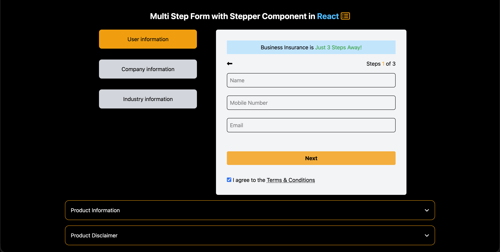
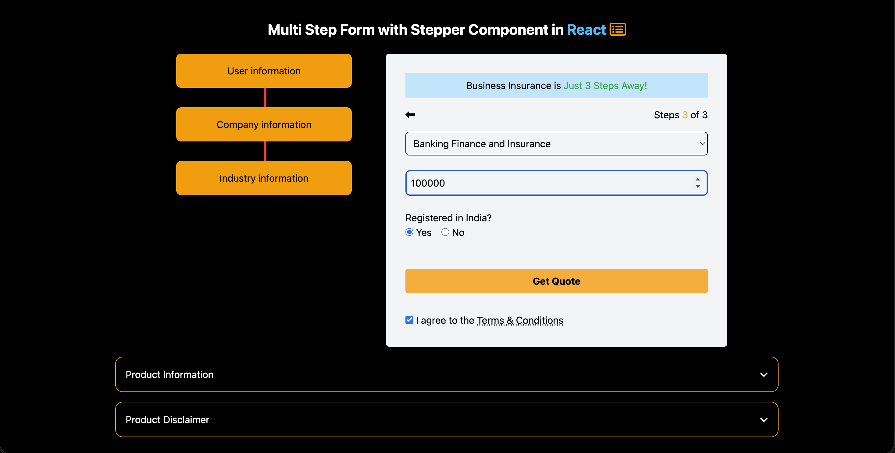
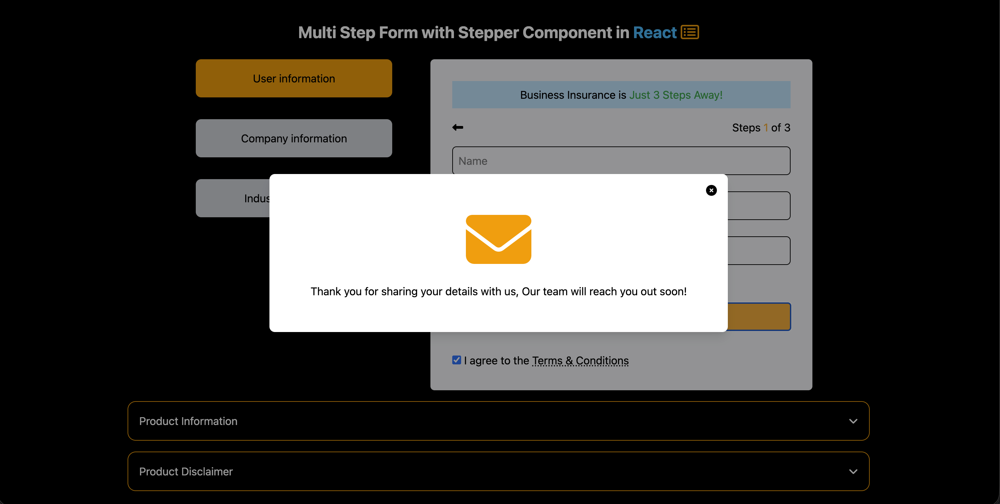
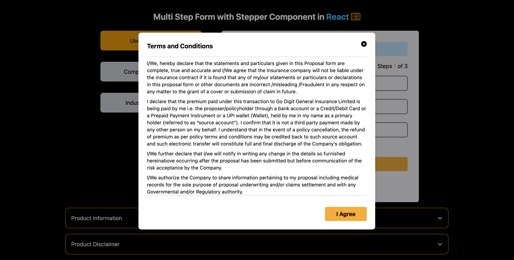
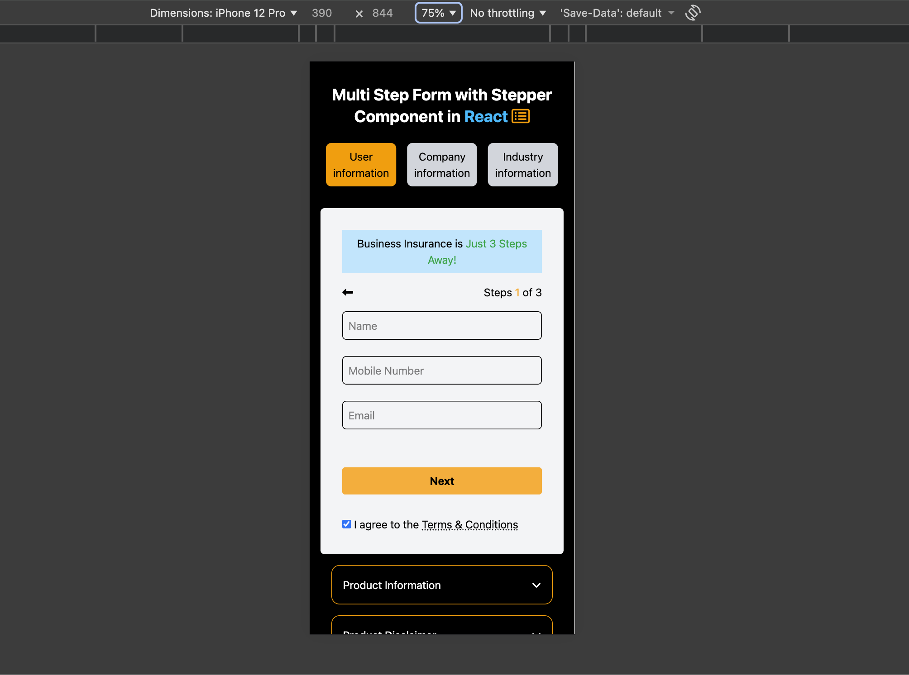

# Multi Step Form – Business Insurance

A multi-step business insurance form built with React to simulate a real-world product onboarding flow. 
The project focuses on form validation, step-based navigation, reusable UI components, and modal handling using React Portals.

---

## 🛠 Tech Stack

- React
- JavaScript (ES6+)
- Tailwind CSS
- React DOM `createPortal`

---

## ✨ Features

- 3-step business insurance form flow
- Field-level validation for each input
- Stepper component to indicate user progress
- Form submission handling with consolidated data output
- Thank-you modal implemented using React `createPortal`
- Accordion component for product information and disclaimer
- Terms & Conditions modal
- Responsive UI with Tailwind CSS
- Structured and reusable component architecture

---

## 🧠 Key Implementation Details

- Managed step navigation using React state
- Implemented controlled form inputs with validation logic
- Consolidated multi-step data before submission
- Used `createPortal` for rendering modal outside main DOM hierarchy
- Designed reusable Stepper and Accordion components
- Applied conditional rendering for dynamic UI updates
- Structured the project to simulate a real product onboarding experience

---

## 📸 Screenshots

First step desktop view

Final Step Before Submission

Thanks modal after the form submission

Terms and conditions modal

Mobile Device Preview

---

## 📦 Installation

1. Clone the repository

git clone https://github.com/sumanth-git-hub/multi-step-form.git

2. Navigate into the project directory

cd multi-step-form

3. Install dependencies

npm install

4. Start the development server

npm run dev

---

## 📌 What I Learned

- Managing complex multi-step form state in React
- Implementing field validation and controlled inputs
- Building reusable UI components (Stepper, Accordion, Modal)
- Using React Portals for advanced modal handling
- Designing structured user flows similar to real-world insurance products
- Improving UI consistency using Tailwind CSS